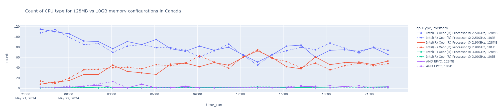

# AWS Lambda CPU Distribution Study

### Characterization of AWS Lambda CPU Heterogeneity across the Global Regions 
  To investigate how the distribution of CPU types varies per AWS region for an AWS Lambda function over a 24-hour period.

### Project Description
  This study will deploy AWS Lambda functions across the regions of Amazon cloud to characterize the distribution of CPU types. The idea is to survey how the CPU type distribution varies by region, and how this distribution may impact function runtime and cost. The project will begin by performing one-off testing with batches of 50 to 500 function calls that create distinct serverless function instances where can be hosted with a distinct CPU type. Later, the project will execute a 24-hour, and perhaps 7-day test to observe how the distribution of CPU types varies over time. Using one or more simple compute-bound profiling functions, and examine the correlation between CPU type distribution and function runtime.

### Learning objectives

- Understand the distribution of CPU types across various AWS regions
- Develop test scripts 
  -  to collect hourly data (125 function calls in each region)
  -  to examine CPU type heterogeneity over a 24-hour period
  -  to characterize CPU type distribution
- Perform data analysis
  - Graphical representation of CPU distribution over 24-hour period for each AWS region
  - Statistical analysis to calculate the maximum, minimum, average, Standard deviation, and CV percentage of each CPU type

### Performance Script

The `125_function_call.ipynb` notebook uses the [FaaSET library](https://github.com/wlloyduw/SAAF/tree/master/tutorial_faaset) to create, and call a lambda function 125 times parallely. 

The code below creates and runs the configuration required for the experiment: 

```python
FaaSRunner.experiment(
                function=hello_world_faaset_128MB_c, 
                runs_per_thread= 1,
                threads= 125,
                payloads=[{"name": "Bob", "time" : 10}],
                experiment_name="func_call_test_128MB_c")
```

### Results

The experiments were run for 7 AWS Regions. It was observed that newer regions had better CPU distribution. The result of the region: Canada



